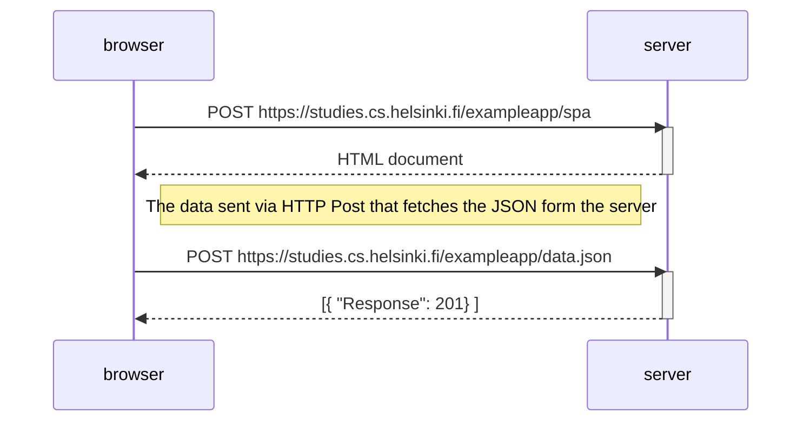

```mermaid
sequenceDiagram
    participant browser
    participant server

    browser->>server: POST https://studies.cs.helsinki.fi/exampleapp/spa
    activate server
    server-->>browser: HTML document
    deactivate server

Note right of browser: The data sent via HTTP Post that fetches the JSON form the server

    browser->>server: POST https://studies.cs.helsinki.fi/exampleapp/data.json
    activate server
    server-->>browser: [{ "Response": 201} ]
    deactivate server

    
```